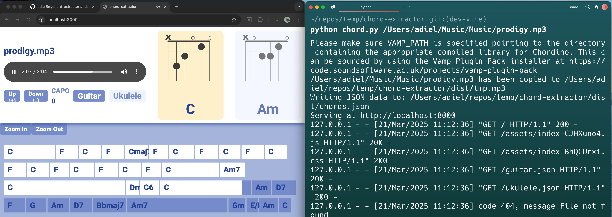

this is an early version of a tool that extracts chords from audio files. It uses [chord-extractor](https://github.com/ohollo/chord-extractor) to extract chords from audio files and `yt-dlp` to download audio from youtube videos. The extracted chords are then displayed using [tombatossals/react-chords](https://github.com/tombatossals/react-chords) + [tombatossals/chords-db](https://github.com/tombatossals/chords-db).

it works for me. i hope it works for you too.



# Requirements

- Python (it's work for me on python 3.8.10)
- [chord-extractor](https://github.com/ohollo/chord-extractor) and its requirements
- https://code.soundsoftware.ac.uk/projects/vamp-plugin-pack/files to install `Chordino and NNLS Chroma` plugins
- yt-dlp

# Usage

You can either: 

- use the prebuilt react app in `dist`, or, 
- build it yourself using `npm i` and `npm run build`.

Inside the project directory run 

```bash
# for a local file
python chord.py path/to/your/file.mp3

# for yt video/audio
python chord.py https://www.youtube.com/watch?v=your_video_id
```

